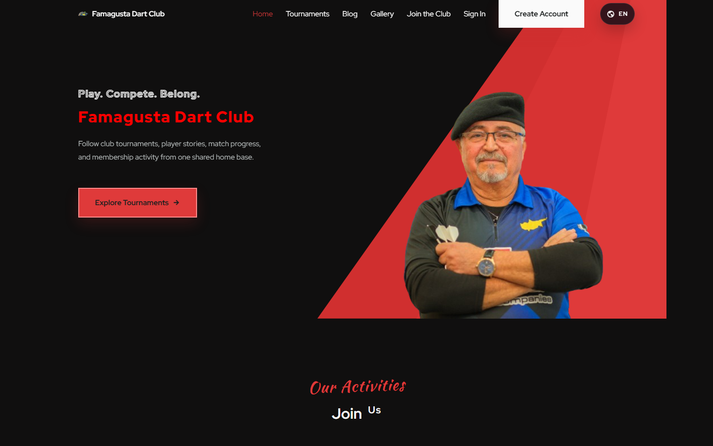
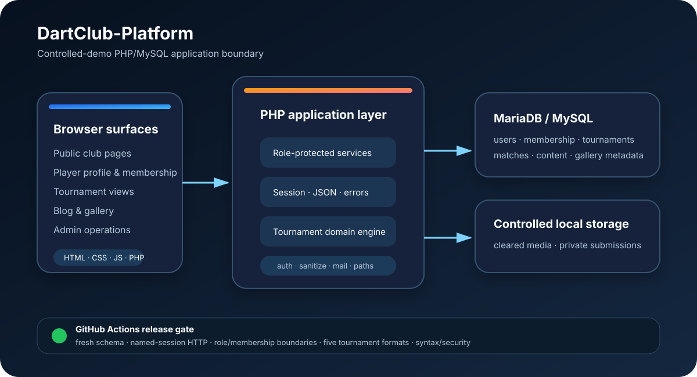

# DartClub-Platform

A maintained plain-PHP/MySQL club operations application with role-aware
administration, membership review, community publishing, and five tournament
formats—including linked single- and double-elimination brackets.



This is a legacy-modernization portfolio project, not a framework rewrite. Its
engineering value is the breadth of real application behavior preserved and
made testable in a deliberately simple stack.

## What it demonstrates

- named, hardened PHP sessions with player, manager, and administrator roles;
- membership submission/review while keeping club status separate from auth role;
- public/player profiles, tournament registration, fixtures, standings, and results;
- Round Robin, League, two-team Group, Elimination, and Double Elimination;
- winner/loser bracket propagation, byes, group promotion, placements, and archives;
- blog drafts/publishing, comments, reactions, gallery integration, and safe rich HTML;
- private local document handling and MIME-validated media uploads;
- a reproducible MariaDB-backed integration job in GitHub Actions.

## Verified release boundary

| Area | Evidence |
| --- | --- |
| Dependencies and syntax | Composer strict validation/audit and full PHP syntax scan |
| Sessions and user administration | HTTP tests prove the `dart_club_session` login path, admin listing/role mutation, and guest/player denial |
| Membership authorization | HTTP tests prove review access and that membership approval does not change auth role |
| Tournament engine | Database contracts exercise all five formats, Round Robin standings, League promotion, Group fixtures, and Double Elimination winner/loser propagation |
| Content safety | UTF-8 sanitizer smoke tests cover event/script/style and unsafe-protocol removal |
| Presentation | Publication guard checks required files, claims, placeholders, and tracked-worktree hygiene |

The release does **not** claim comprehensive browser E2E coverage, Internet-scale
deployment, fault tolerance, realtime scoring, or verified SMTP delivery.

## Architecture



Browser-facing PHP/HTML pages call role-protected service endpoints. Shared
bootstrap, auth, sanitization, mail, player, and tournament helpers own common
behavior; MySQL/MariaDB stores application state, while approved local paths
hold media and membership documents.

## Contribution

Ali Farrokhnejad authored and maintains the application code, including the
portfolio hardening and verification work. Morteza Farrokhnejad and Nazife
Dimililer contributed non-code project support.

## Stack

- PHP 8.3+ and Apache or PHP's development server
- MySQL/MariaDB
- plain JavaScript, HTML, and CSS
- Composer with PHPMailer 6.12.x
- Python 3 for HTTP integration and publication checks

## Local setup

Install the locked dependency set:

```bash
composer install
```

Create and import the development database:

```bash
mysql -u root -p -e "CREATE DATABASE IF NOT EXISTS dart_club"
mysql -u root -p dart_club < dart_club.sql
```

PowerShell does not support shell-style input redirection. Use:

```powershell
Get-Content -Raw dart_club.sql | mysql -u root -p dart_club
```

Copy `services/config.local.example.php` to the ignored
`services/config.local.php`, then set the local database values. Environment
variables are also supported:

- `APP_ENV`
- `APP_DB_HOST`, `APP_DB_PORT`, `APP_DB_NAME`
- `APP_DB_USER`, `APP_DB_PASS`, `APP_DB_CHARSET`
- optional `SMTP_HOST`, `SMTP_PORT`, `SMTP_AUTH`, `SMTP_USER`, `SMTP_PASS`,
  `SMTP_SECURE`, and `SMTP_FROM`

Start a lightweight development server:

```bash
php -S 127.0.0.1:8090 -t .
```

Use Apache or equivalent server rules when validating direct access denial for
membership documents.

## Verification

Static/security checks:

```bash
composer validate --strict
composer install --no-interaction --prefer-dist
composer audit --no-interaction
python3 scripts/publication_guard.py
php scripts/security_smoke.php
```

After importing a fresh database and exporting the `APP_DB_*` variables:

```bash
php tests/prepare_integration_fixture.php
php tests/tournament_contracts.php
python3 tests/http_integration.py
```

The fixture values are local-only synthetic test data. See
[`docs/RUN_PROTOCOL.md`](docs/RUN_PROTOCOL.md) for the complete ladder and
[`docs/TESTING_CHECKLIST.md`](docs/TESTING_CHECKLIST.md) for optional broader
manual browser coverage.

## Security and deployment boundary

This repository is intended for local demonstration or controlled deployment.
Before any Internet-facing use, independently review TLS/origin configuration,
rate limiting, account recovery, private-file server rules, filesystem quotas,
SMTP policy, seed accounts, backups, and data retention.

Passwords use PHP password hashes; the maintained login path can migrate legacy
plaintext/MD5 development rows after a verified login. New credentials must
never use a legacy format. Self-service password reset is intentionally absent;
the application directs users to administrator/support recovery.

See [`SECURITY.md`](SECURITY.md) for the full trust boundary.

## Data, forms, and media

The checked-in accounts and profile fields are synthetic or publication-
consented fixtures. The blank DOCX forms under `other/` are intentionally public
templates for users to download, complete, and submit. Retained photographs and
logos are owner-created or cleared for public redistribution.

The current photographs are web-sized copies; original high-resolution files do
not belong in the maintained tree.

## Known limitations

- local server storage rather than object storage;
- Apache-specific `.htaccess` rules require equivalents on other servers;
- manual administrator/support account recovery;
- best-effort, deployment-specific email;
- no application-level rate limiter under the controlled-demo boundary;
- several large tournament files remain mixed-concern legacy code;
- no exhaustive browser/device, SMTP, or real-host verification;
- historical Git objects make the repository roughly 443 MiB even though the
  maintained tree is much smaller.

The large history is retained intentionally as authentic development evidence;
this release uses the same repository and normal commits rather than a rewritten
or replacement history.

## Documentation

- [`docs/PROJECT_STATE.md`](docs/PROJECT_STATE.md) — current implemented state
- [`docs/REPO_MAP.md`](docs/REPO_MAP.md) — routes, services, and data flow
- [`docs/RUN_PROTOCOL.md`](docs/RUN_PROTOCOL.md) — reproducible checks
- [`PUBLICATION.md`](PUBLICATION.md) — release evidence and boundaries
- [`SECURITY.md`](SECURITY.md) — security policy

## License

Source code is available under the [MIT License](LICENSE). Media and trademarks
retain their respective ownership and are not relicensed by the source license.
